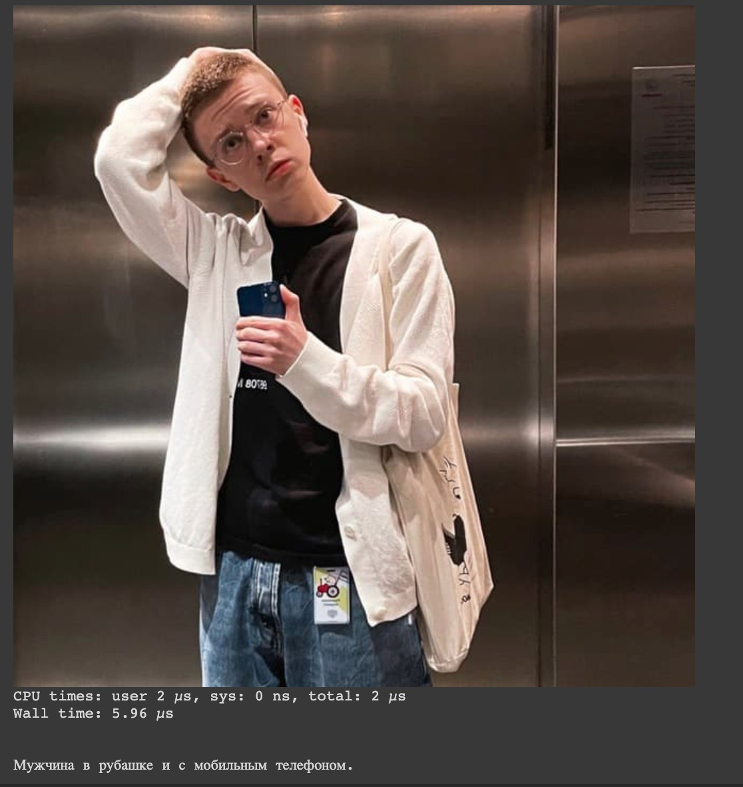

# ruImageCaptioning


<a href="https://opensource.org/licenses/MIT"></a>  
Inference Notebook: <a href="https://colab.research.google.com/drive/1tsVMWUE6_AKXiHyinCSOSRPGhbjVEyRM?usp=sharing"></a>  

[Hugginface🤗](https://huggingface.co/AlexWortega/ruImagecaptioning/tree/main)

Русская версия CLIP prefix caption, обученная на ruGPTSMALL + CLIP(OPENAI), можно использовать для VQA, image captioning и прочее. Модель работает <1c + ее можно эффективно квантануть/перенести в ONNX. Обучалось в течении 3х дней на 2*1080ti

Trained and validated on ruCOCO
BLEU:     	37.3

chrF:     	32.4

ROUGE-1-F:	33.0

ROUGE-2-F:	14.1

ROUGE-L-F:	30.3

<table>
  <tr>
    <td></td>
    <td></td>
   
  </tr>
  <tr>
    <td> Пример кэпшенинга</td>
     <td>Пример работы в zero shot</td>
     
  </tr>
 </table>


THIS WORK IS BASED ON https://github.com/rmokady/CLIP_prefix_caption (english version)
```
@article{mokady2021clipcap,
  title={ClipCap: CLIP Prefix for Image Captioning},
  author={Mokady, Ron and Hertz, Amir and Bermano, Amit H},
  journal={arXiv preprint arXiv:2111.09734},
  year={2021}
}
```
```
@article{AlexWortega,
  title={ruImage captioning},
  author={Aleksandr Nikolic, Asta gpu server },
}
```

## Acknowledgments
This repository is heavily based on [CLIP](https://github.com/openai/CLIP) and [Hugging-faces](https://github.com/huggingface/transformers) repositories.
For training we used the data of [COCO dataset](https://cocodataset.org/#home)  and [Conceptual Captions](https://ai.google.com/research/ConceptualCaptions/) translated by ALEX WORTEGA [ruCOCO](https://github.com/AlexWortega/ru_COCO)  
